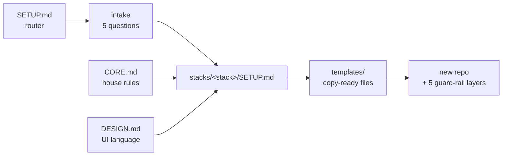

<div align="center">

# toolu-conventions

**A conventions kit an AI agent can execute.**
Hand [`SETUP.md`](./SETUP.md) to a coding agent and it scaffolds a new project with the
same structure, tooling, and guard rails every time — across five stacks.

[](./.github/workflows/ci.yml)
[](./.github/workflows/code-review.yml)
[](https://falconiere.github.io/toolu-conventions/)
[](#the-five-stacks)

[Guide](https://falconiere.github.io/toolu-conventions/) ·
[Design system](https://falconiere.github.io/toolu-conventions/design-system.html) ·
[Core rules](./CORE.md) ·
[Design language](./DESIGN.md)

</div>

---

## What this is

Markdown an agent executes, plus copy-ready templates. **No CLI, no generator, nothing
to install.** You clone the kit next to an empty repo, point an agent at `SETUP.md`, and
answer five intake questions. The agent does the rest and prints the human-only
checklist at the end.

The point is not "a nice starter". The point is that project #7 has the same folder
tree, the same banned dependencies, the same lint config, and the same five enforcement
layers as project #1 — and that an agent working inside it gets told *while it types*
when it drifts.

## Quick start

```bash
git clone https://github.com/Falconiere/toolu-conventions.git
mkdir my-new-project && cd my-new-project
```

Then, in your agent of choice:

> **Set up this project by following `../toolu-conventions/SETUP.md`.**

The agent will:

1. **Check prerequisites** — `git`, `bun` (TS stacks), `cargo` (rust), `jq`. The rust stack
   additionally needs ast-grep, for the two pattern rules clippy doesn't cover — install it
   yourself with `cargo install ast-grep --locked`; the agent verifies and reports, it
   never installs.
   Neither `jq` nor ast-grep is optional where it applies: the guard-rail gate exits `3`
   rather than silently passing when one is missing.
2. **Ask intake** — stack · project name · staging? · optional integrations · design context.
3. **Dispatch** to `stacks/<stack>/SETUP.md` and scaffold end to end.
4. **Run the gate** and only then hand back a human checklist (Cloudflare login, Turso
   database, repo secrets, branch protection — things only a human can do).



## The five stacks

| Stack | Builds | Runs on |
| --- | --- | --- |
| [`console`](./stacks/console/) | The authenticated product app (SPA) | React + Vite + TanStack Router · TS strict · bun · Vitest → Cloudflare Workers |
| [`marketing`](./stacks/marketing/) | The public website | Astro (static) · TS strictest · bun · Vitest → Cloudflare Workers |
| [`backend-ts`](./stacks/backend-ts/) | The HTTP API | Hono → Cloudflare Workers (workerd) · Turso · Vitest in the real runtime |
| [`expo`](./stacks/expo/) | The mobile app | Expo (latest SDK) · Expo Router · bun · Jest |
| [`rust`](./stacks/rust/) | A CLI or service | Single crate · clippy `-D warnings` · rustfmt · cargo test |

A full product is usually **three repos** from this kit — `marketing` (the public site),
`console` (the app behind the login), and `backend-ts` (the API they both talk to). They
share one design language and one token set, so a visitor who signs up feels no seam.

Every `stacks/<stack>/` holds the same four things:

| File | Contents |
| --- | --- |
| `SETUP.md` | The step-by-step scaffold prompt |
| `STRUCTURE.md` | Folder tree + hard conventions |
| `LIBRARIES.md` | Reach-for-these list + AVOID list |
| `templates/` | Copy-ready files under their real filenames (only `CLAUDE.md.template` is suffixed) |

What is *not* in `templates/` is anything identical across stacks: the guardrails module comes
from [`guardrails/`](./guardrails/) and the agent-hook `settings.json` from
[`shared/`](./shared/). A stack's `templates/` holds what genuinely varies — including its own
`guardrails.config.json`.

## The defaults, in one place

One answer per job, so no project re-litigates them:

| Decision | Answer |
| --- | --- |
| Host · Database · Auth | Cloudflare Workers · Turso · better-auth |
| Validation | **Zod** at every boundary, types from `z.infer` |
| Our own API | **oRPC** — procedures typed end to end; query keys from the procedure path |
| Client data | TanStack Query (+ `@orpc/tanstack-query`) |
| Forms | TanStack Form (`@tanstack/react-form`) + Zod via Standard Schema |
| HTTP for everything else | the kit's own `src/utilities/http.ts` over `fetch` — **axios is banned**, in lint *and* in the structure check |
| Package manager · Lint/format · Hooks | bun · oxlint + oxfmt · Lefthook |
| Gate extras | knip (unused files/exports/deps) + jscpd (copy-paste) |
| Structure gate | oxlint house plugin + [`agent-guardrails`](#agent-guardrails) |

These are **not** intake questions. See [`CORE.md` → Platform defaults](./CORE.md).

## Guard rails

Every generated project ships five layers, and the kit treats all five as mandatory:

| Layer | Where | When it fires |
| --- | --- | --- |
| 1. Written rules | `CLAUDE.md` | Every agent turn, as context |
| 2. Agent hooks | `.claude/settings.json` (from [`shared/`](./shared/)) | On every file an agent writes (`PostToolUse`) and again before it finishes a turn (`Stop`) |
| 3. Pre-commit | `lefthook.yml` | `git commit` |
| 4. CI gate | `.github/workflows/ci.yml` | Every PR — steps mirror `bun run check` one-for-one and end in a real build |
| 5. AI code review | `.github/workflows/code-review.yml` | Every PR, judged against the repo's own convention files read from the base branch |

Layers 4 and 5 need two human actions to be real: the `DEEPSEEK_API_KEY` repository
secret, and requiring **CI** and **Code Review** on `main`. Without them, two of the five
are decorative — which is why they're on the generated checklist.

### agent-guardrails

[`guardrails/`](./guardrails/) is the kit's structural gate: **one config-driven module**,
copied verbatim into every project, that enforces what a linter structurally cannot see.

> **Two paths, one module.** `guardrails/` is the source, here in the kit. A scaffold copies
> it to **`scripts/guardrails/`** in the generated project — the path
> [`CORE.md`](./CORE.md), every stack's `SETUP.md`, and the `.claude/settings.json` hooks all
> name, because they describe a project rather than this repo. Neither path is stale; they're
> source and destination. Full detail in [`guardrails/README.md`](./guardrails/README.md).

```
guardrails/               # in a generated project: scripts/guardrails/
├── run.sh                # entry point — repo · --file · --hook · --stop modes
├── lib/                  # config load + validate, output + exit codes
├── checks/               # 13 checks: folder-tree, secrets, secret-content, banned-deps, …
├── oxlint-plugin/        # 5 house rules that run inside oxlint, as the file is written
├── patterns/rust/        # ast-grep rules for what clippy doesn't cover
├── schema.json           # guardrails.config.json contract
└── __tests__/            # fixtures + plugin + latency suites — kit only, never shipped
```

Four properties are worth knowing:

- **One rule, one enforcer.** Anything a linter *can* see (folder tree, intra-domain
  shape, barrels, colocated tests, bare `fetch`, hardcoded colours) runs inside **oxlint**
  via the house plugin, so it fires as the file is written. `ownedByLinter` in
  `guardrails.config.json` declares the split, and the bash module skips whatever the
  linter owns. Two enforcers of one rule is how ceilings drift apart.
- **Stack differences are data, not code** — `guardrails.config.json`, validated by
  `schema.json`. It replaced five hand-written per-stack scripts that had already drifted.
- **One copy, not six.** Each stack used to ship its own byte-identical mirror of the module
  under `templates/scripts/guardrails/` — 135 files kept honest by a `diff -r` in CI. The
  scaffold now reads the kit's `guardrails/` directly, so there is nothing left to drift.
- **A slow gate gets routed around**, so latency is a tested budget, measured on a
  generated 500-file / 20-feature tree: **repo mode < 2000 ms**, **`--file` mode < 250 ms**.

Exit codes: `0` clean · `1` violations · `2` violations in a hook mode · `3` misconfigured —
which covers a missing required tool (`jq`, or `ast-grep` on rust) as well as a bad config.
The `2` is load-bearing — Claude Code ignores a `1` from a hook, so only `2` shows stderr
on `PostToolUse` and only `2` blocks on `Stop`.

## The kit runs on itself

A kit that preaches five mandatory layers while running none of them is just a document.
So this repo has its own [`ci.yml`](./.github/workflows/ci.yml) and
[`code-review.yml`](./.github/workflows/code-review.yml), and
`scripts/validate-templates.sh` fails if either goes missing.

That one script is the whole gate, so it's worth knowing what it covers:

- every JSON / JSONC / YAML / TOML template **parses**;
- every TS/TSX template passes **oxfmt** and is linted **twice** — once with a minimal
  config, once with each stack's *real* `.oxlintrc.json`, at project-relative paths so the
  config's `overrides` match as they will in a scaffold;
- the dependency-free templates and `http.ts` **strict-type-check**;
- the `--tone-*` values **agree** across `theme/colors.ts` and both stylesheets;
- cross-stack and kit-level template references **resolve** — `marketing` and `expo`
  deliberately copy from `console`, and every stack copies from `guardrails/` and
  [`shared/`](./shared/); those paths are prose in `SETUP.md`, so nothing else catches a rename;
- **no stack has re-grown a duplicate** of the guardrails module, the hook `settings.json`, or
  the shared folder-README — and `expo`/`rust` still ship the folder-READMEs that genuinely differ;
- every stack ships **both workflows**, and every TS stack also ships `knip.json` and a
  `.jscpd.json` with `exitCode: 1` (they're JS-only tools, so `rust` ships neither);
- the guardrails **fixture and oxlint-plugin suites** run — real trees, real oxlint,
  nothing stubbed (the latency suite is run by hand, see [Maintaining](#maintaining));
- the rust skeleton is materialized into a temp crate and passes **fmt + clippy**.

Adding a convention usually means adding a check here too.

## Repo map

| Path | Purpose |
| --- | --- |
| [`SETUP.md`](./SETUP.md) | ★ **Entry point.** Router: prereq checks → intake → dispatch |
| [`CORE.md`](./CORE.md) | Stack-agnostic house rules every stack inherits — hard rules, platform defaults, the five layers |
| [`DESIGN.md`](./DESIGN.md) | Stack-agnostic UI/UX language (CodaSignal "Signal") the theme tokens ship pre-filled with |
| [`guardrails/`](./guardrails/) | `agent-guardrails` — the structural gate, one source, copied into every project as `scripts/guardrails/` |
| [`lint/`](./lint/) | The shared oxlint/oxfmt core, copied byte-identically into every TS stack's `templates/`. Not distributed on its own |
| [`shared/`](./shared/) | Template files identical across stacks — the agent-hook `settings.json`, the folder-README |
| [`stacks/`](./stacks/) | The five stack kits — per-stack docs, `guardrails.config.json`, and what genuinely varies |
| [`docs/`](./docs/) | The human-readable guide (GitHub Pages) + design docs under `docs/toolu/` |
| [`scripts/`](./scripts/) | Dev-only kit maintenance (`validate-templates.sh`). Not part of the distributed kit |

## Maintaining

When a convention changes, update `CORE.md` / `DESIGN.md` **or** the stack kit **and its
templates together** — docs and templates stay in lockstep. Then:

```bash
bash scripts/validate-templates.sh      # the same command CI runs
bash guardrails/__tests__/run-fixtures.sh
bash guardrails/__tests__/run-plugin.sh
bash guardrails/__tests__/run-latency.sh
```

Specs, plans, and decision records live in [`docs/toolu/`](./docs/toolu/).

---

> **v0.3** (2026-08) — one guardrails source. The five byte-identical copies of the module
> under `stacks/*/templates/scripts/guardrails/` are gone; a scaffold copies the manifest
> straight out of the kit's [`guardrails/`](./guardrails/). New [`shared/`](./shared/) holds
> the template files that were identical across stacks — the agent-hook `settings.json` and
> the folder-README. Stack `SETUP.md` files name the kit path and the project path
> distinctly, and the paths are documented rather than inferred. Copy SOURCES in a stack
> `SETUP.md` are anchored to `$KIT` rather than written relative to the file — the
> scaffolding agent's CWD is the new project it's building, not the kit — and
> `scripts/validate-templates.sh` now enforces it.
>
> **v0.2** (2026-07, plus `agent-guardrails` in 2026-08) — `web` renamed to `console` and rebuilt on React + Vite + TanStack Router; new
> `marketing` (Astro) kit; `backend-ts` moved to Cloudflare Workers + Turso; better-auth
> adopted; oRPC + TanStack Query as the API layer; Zod adopted as the one validator
> (replacing hand-written guards); axios replaced by the kit's `http.ts`; knip + jscpd
> added to the gate; `code-review.yml` added to every stack — and to this repo, which now
> runs its own CI; **`agent-guardrails`** replaced the five drifting per-stack structure
> scripts with one tested, config-driven module. Expo validated end-to-end, other stacks
> template-validated.
